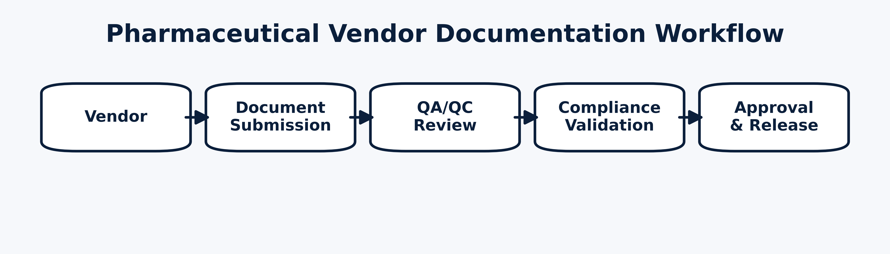

# Pharmaceutical Documentation Analysis & AI Readiness



## What this is
This project converts a pharma documentation learning module into a public, employer-ready artifact. It explains how vendor documentation is handled, why compliance matters, and where AI reduces errors and review time.

## What’s included
- Vendor documents (PDFs): CoA, SDS, Calibration Record
- Visuals: workflow diagram, compliance risk heatmap, document handling flow
- Writeups: workflow overview, compliance challenges, document structure, AI opportunities
- Script to regenerate visuals

## Repository structure
```
pharma-doc-analysis/
├── data/
│   └── vendor_documents/
│       ├── certificate_of_analysis.pdf
│       ├── safety_data_sheet.pdf
│       └── calibration_record.pdf
├── analysis/
│   ├── pharma_overview.md
│   ├── compliance_challenges.md
│   ├── vendor_doc_structure.md
│   └── ai_opportunities.md
├── visuals/
│   ├── pharma_workflow.png
│   ├── compliance_risk_map.png
│   └── document_flowchart.png
└── scripts/
    └── generate_visuals.py
```

## Regenerate visuals
```bash
python -m pip install numpy matplotlib
python scripts/generate_visuals.py
```

## Author
Yengkong Sayaovong (2026)
